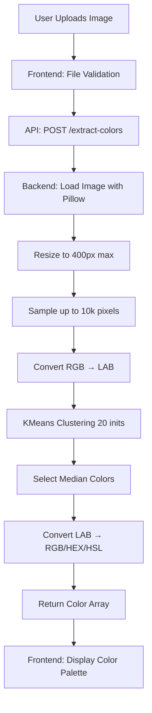
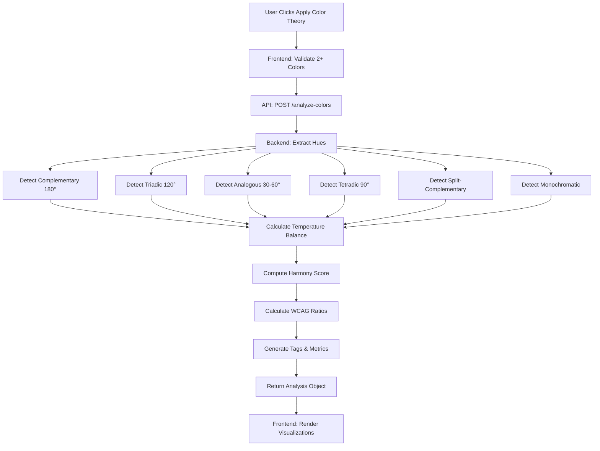
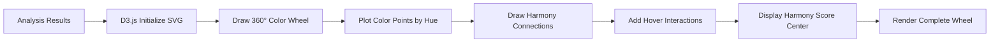
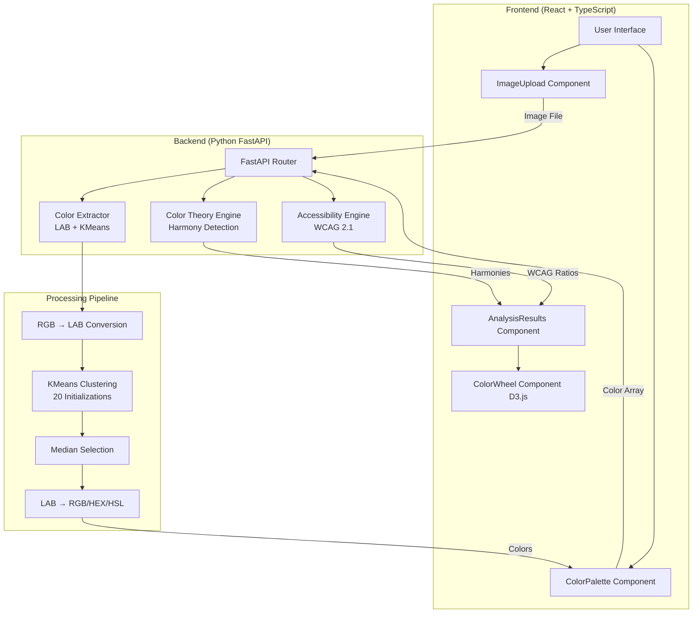
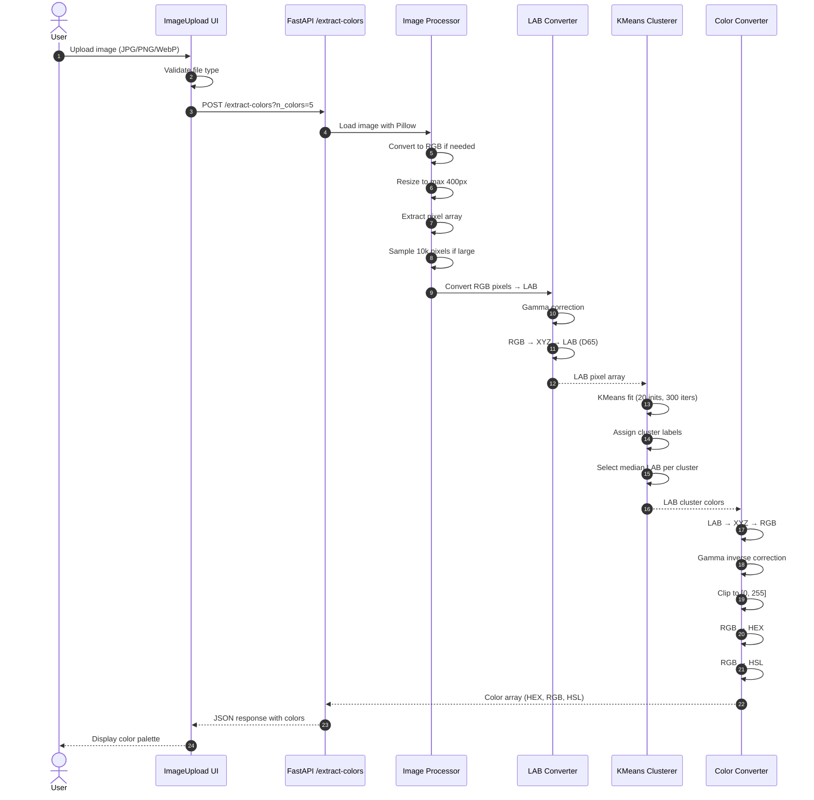
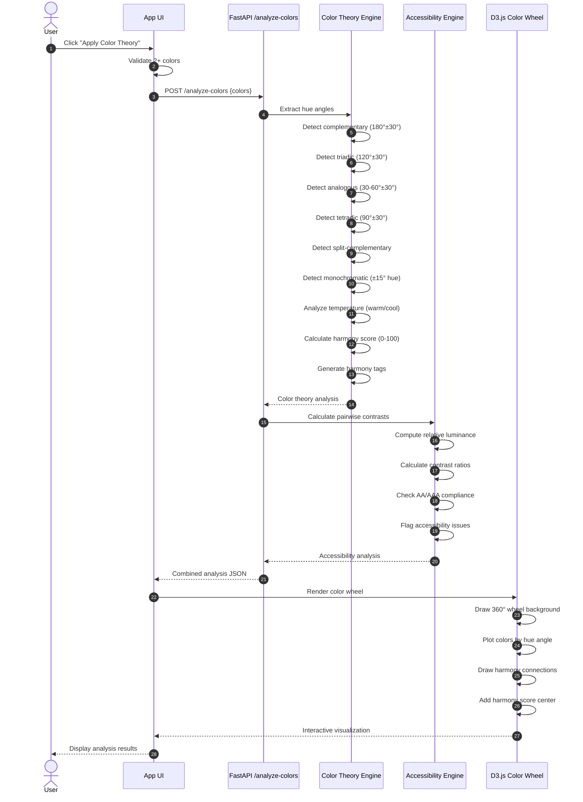
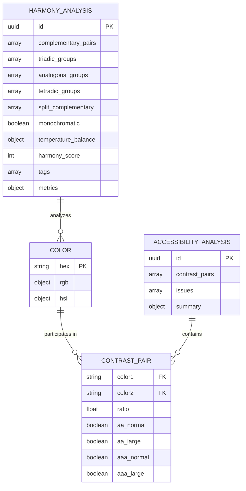

# ColorCraft

[](https://github.com/Artsen/ColorCraft)

ColorCraft is an intelligent visual design companion that transforms images into actionable color insights. Upload a photo, extract dominant colors using perceptual clustering, and instantly analyze color harmonies, accessibility compliance, and aesthetic balance. Whether you're a designer seeking palette validation, a developer ensuring WCAG compliance, or an artist exploring color relationships, ColorCraft provides the data-driven feedback you need.

## Table of Contents
- [Overview](#overview)
- [What's New](#whats-new)
- [Plain-English Tour](#plain-english-tour)
- [Repository Layout](#repository-layout)
- [Key Capabilities](#key-capabilities)
  - [Backend](#backend)
  - [Frontend](#frontend)
- [Architecture](#architecture)
- [Prerequisites](#prerequisites)
- [Environment Setup](#environment-setup)
- [Backend Setup](#backend-setup)
- [Frontend Setup](#frontend-setup)
- [Running the Stack](#running-the-stack)
- [Using ColorCraft](#using-colorcraft)
  - [Workflow Options](#workflow-options)
  - [Controls Reference](#controls-reference)
  - [Exploration Tips](#exploration-tips)
- [Color Extraction Algorithm](#color-extraction-algorithm)
- [Color Theory Engine](#color-theory-engine)
- [Accessibility Analysis](#accessibility-analysis)
- [API Endpoints](#api-endpoints)
- [Data Flow & Processing](#data-flow--processing)
- [Troubleshooting](#troubleshooting)
- [Roadmap & Next Steps](#roadmap--next-steps)
- [Contributing](#contributing)
- [License](#license)
- [Mermaid Diagrams](#mermaid-diagrams)

## Overview

ColorCraft bridges the gap between subjective color choices and objective color science. Instead of manually checking contrast ratios or guessing at harmony relationships, you upload an image or build a palette manually, and ColorCraft does the heavy lifting: perceptual color extraction in LAB space, multi-dimensional harmony detection (complementary, triadic, analogous, split-complementary, tetradic, monochromatic), WCAG 2.1 accessibility validation, and interactive D3.js visualization showing exactly how your colors relate on the color wheel.

## What's New

- **Windows compatibility fix**: Removed UMAP dependency to eliminate numba/coverage conflicts on Windows systems
- **Manual-only workflow**: Skip image upload entirely and start with custom colors using the "Skip & Add Colors Manually" button
- **IPv4 proxy fix**: Explicit 127.0.0.1 targeting for Windows Node.js compatibility
- **Start Over functionality**: Reset and try different images or workflows without page reload
- **LAB color space clustering**: Direct KMeans clustering in perceptual LAB space with 20 initializations for stable, accurate results
- **Default starter palette**: Beautiful gradient colors (#667eea, #764ba2, #f093fb) when skipping upload
- **Enhanced UX flow**: Seamless transitions between upload and manual workflows

## Plain-English Tour

Think of ColorCraft as your color theory assistant. Here's the journey without jargon:

1. **Choose your starting point.** Upload an image to extract its colors, or skip and add colors manually.
2. **Extract dominant colors.** If you uploaded an image, select how many colors (3-10) you want to extract. ColorCraft analyzes the image in perceptual LAB color space and finds the most representative colors using KMeans clustering.
3. **Refine your palette.** Add, remove, or edit colors. Click any color swatch to change it with the color picker, or type HEX values directly.
4. **Analyze color relationships.** Click "Apply Color Theory" and ColorCraft examines your palette for:
   - **Harmony patterns**: Complementary pairs, triadic triangles, analogous neighbors, split-complementary schemes, tetradic squares, and monochromatic variations
   - **Temperature balance**: Warm vs. cool color distribution
   - **Accessibility**: WCAG AA/AAA contrast ratios for every color pair
   - **Aesthetic metrics**: Hue diversity, saturation balance, lightness range
5. **Explore the color wheel.** See your colors plotted on an interactive D3.js color wheel with visual connections showing detected harmonies. The center displays your harmony score (0-100).
6. **Review detailed insights.** Scroll down to see harmony tags, temperature analysis, accessibility warnings, and a complete contrast ratio table.

If you remember only one thing: ColorCraft turns subjective color choices into objective, measurable insights.

## Repository Layout

```text
.
├── README.md                     # This guide
├── LICENSE                       # MIT License
├── CONTRIBUTING.md               # Contribution guidelines
├── backend/                      # Python FastAPI backend
│   ├── main.py                   # FastAPI application entry point
│   ├── color_extractor.py        # KMeans clustering in LAB color space
│   ├── color_theory.py           # Harmony detection algorithms
│   ├── accessibility.py          # WCAG 2.1 contrast calculations
│   └── requirements.txt          # Python dependencies
├── frontend/                     # React + TypeScript frontend
│   ├── src/
│   │   ├── components/           # React components
│   │   │   ├── ImageUpload.tsx   # File upload and extraction UI
│   │   │   ├── ColorPalette.tsx  # Color grid with editing
│   │   │   ├── ColorWheel.tsx    # D3.js visualization
│   │   │   └── AnalysisResults.tsx # Harmony and accessibility display
│   │   ├── App.tsx               # Main application component
│   │   ├── main.tsx              # React entry point
│   │   └── index.css             # Global styles with Tailwind
│   ├── package.json              # Frontend dependencies
│   ├── vite.config.ts            # Vite configuration
│   ├── tailwind.config.js        # Tailwind CSS configuration
│   └── tsconfig.json             # TypeScript configuration
└── .gitignore                    # Git ignore patterns
```

## Key Capabilities

### Backend

- **Perceptual color extraction**: Converts RGB to LAB color space for human-vision-aligned clustering
- **KMeans clustering**: 20 initializations for stable, deterministic color extraction
- **LAB ↔ RGB conversion**: High-precision color space transformations with D65 white point
- **Color theory engine**: Hue angle mathematics for harmony detection with configurable tolerance
- **Harmony detection**: Complementary (180°), analogous (30-60°), triadic (120°), tetradic (90°), split-complementary, and monochromatic patterns
- **Temperature analysis**: Warm vs. cool color classification and ratio calculation
- **WCAG 2.1 compliance**: Relative luminance calculation and contrast ratio formulas
- **Accessibility validation**: AA/AAA compliance checking for normal and large text
- **Harmony scoring**: Multi-factor scoring algorithm (0-100) based on detected harmonies, saturation balance, and lightness distribution
- **FastAPI framework**: RESTful API with automatic OpenAPI documentation
- **CORS support**: Configured for local development and production deployment

### Frontend

- **Dual workflow support**: Image upload with extraction OR manual color creation
- **Interactive color editing**: Click-to-edit swatches with native color picker
- **HEX input validation**: Real-time validation and RGB/HSL conversion
- **D3.js color wheel**: Interactive visualization with harmony connections and hover effects
- **Harmony visualization**: Visual lines connecting complementary pairs, triadic triangles, and tetradic squares
- **Dynamic harmony score**: Central display of 0-100 harmony score with visual prominence
- **Responsive design**: Tailwind CSS with mobile-first approach
- **State management**: React hooks for efficient re-rendering
- **Color format conversion**: Seamless HEX ↔ RGB ↔ HSL transformations
- **Accessibility-first UI**: High contrast, semantic HTML, keyboard navigation
- **TypeScript safety**: Full type coverage for color objects and API responses

## Architecture

ColorCraft follows a clean client-server architecture:

```
┌─────────────────────────────────────────────────────────────┐
│                        Frontend (React)                      │
│  ┌────────────┐  ┌────────────┐  ┌──────────────────────┐  │
│  │  Image     │  │   Color    │  │   Color Wheel        │  │
│  │  Upload    │→ │  Palette   │→ │   Visualization      │  │
│  └────────────┘  └────────────┘  └──────────────────────┘  │
│         │               │                     ↑              │
│         └───────────────┴─────────────────────┘              │
│                         │                                    │
│                    API Calls (REST)                          │
└─────────────────────────┼───────────────────────────────────┘
                          │
                          ↓
┌─────────────────────────────────────────────────────────────┐
│                     Backend (FastAPI)                        │
│  ┌──────────────┐  ┌──────────────┐  ┌──────────────────┐  │
│  │   Color      │  │    Color     │  │  Accessibility   │  │
│  │  Extractor   │  │   Theory     │  │    Engine        │  │
│  │  (LAB+KMeans)│  │   Engine     │  │  (WCAG 2.1)      │  │
│  └──────────────┘  └──────────────┘  └──────────────────┘  │
└─────────────────────────────────────────────────────────────┘
```

## Prerequisites

- **Python 3.11+** (3.11 recommended for best compatibility)
- **Node.js 18+** (LTS version recommended)
- **pnpm** (package manager for frontend)
- **pip** (Python package installer)

**Platform Support:**
- ✅ Windows 10/11
- ✅ macOS 11+
- ✅ Linux (Ubuntu 20.04+, Debian 11+)

## Environment Setup

### Windows

```powershell
# Check Python version
python --version  # Should be 3.11+

# Check Node version
node --version    # Should be 18+

# Install pnpm globally
npm install -g pnpm

# Upgrade pip
python -m pip install --upgrade pip
```

### macOS / Linux

```bash
# Check Python version
python3 --version  # Should be 3.11+

# Check Node version
node --version     # Should be 18+

# Install pnpm globally
npm install -g pnpm

# Upgrade pip
python3 -m pip install --upgrade pip
```

## Backend Setup

### Option A: Virtual Environment (Recommended)

**Windows:**
```powershell
cd backend
python -m venv venv
venv\Scripts\activate
pip install -r requirements.txt
```

**macOS / Linux:**
```bash
cd backend
python3 -m venv venv
source venv/bin/activate
pip install -r requirements.txt
```

### Option B: Global Installation

```bash
cd backend
pip install -r requirements.txt
```

### Dependencies Installed

- **fastapi** (0.104.1): Modern web framework for building APIs
- **uvicorn** (0.24.0): ASGI server for FastAPI
- **python-multipart** (0.0.6): File upload support
- **pillow** (10.1.0): Image processing library
- **numpy** (1.26.2): Numerical computing
- **scikit-learn** (1.3.2): KMeans clustering and metrics
- **pydantic** (2.5.0): Data validation and settings management

## Frontend Setup

```bash
cd frontend
pnpm install
```

### Dependencies Installed

- **react** (18.3.1): UI component library
- **react-dom** (18.3.1): React DOM rendering
- **typescript** (5.9.3): Type-safe JavaScript
- **vite** (5.4.20): Fast build tool and dev server
- **tailwindcss** (3.4.18): Utility-first CSS framework
- **d3** (7.9.0): Data visualization library
- **axios** (1.12.2): HTTP client for API calls

## Running the Stack

### Terminal 1: Backend

**Windows:**
```powershell
cd backend
venv\Scripts\activate  # If using virtual environment
python main.py
```

**macOS / Linux:**
```bash
cd backend
source venv/bin/activate  # If using virtual environment
python main.py
```

**Expected output:**
```
INFO:     Started server process [XXXX]
INFO:     Waiting for application startup.
INFO:     Application startup complete.
INFO:     Uvicorn running on http://0.0.0.0:8000 (Press CTRL+C to quit)
```

**Verify:** Visit http://localhost:8000 → Should see `{"status":"ok","message":"ColorCraft API is running"}`

### Terminal 2: Frontend

```bash
cd frontend
pnpm dev
```

**Expected output:**
```
  VITE v5.4.20  ready in XXX ms

  ➜  Local:   http://localhost:5173/
  ➜  Network: use --host to expose
  ➜  press h + enter to show help
```

**Access:** Open http://localhost:5173 in your browser

## Using ColorCraft

### Workflow Options

#### Option 1: Image Upload & Extraction

1. **Upload an image**: Click the upload area or drag and drop a JPG, PNG, or WebP file
2. **Select color count**: Use the slider to choose 3-10 colors
3. **Extract colors**: Click "Find Colors" button
4. **Wait for processing**: Typically 1-2 seconds for standard images
5. **Review extracted colors**: See swatches with HEX, RGB, and HSL values
6. **Optional refinement**: Add, remove, or edit colors manually
7. **Analyze**: Click "Apply Color Theory" to see harmony and accessibility analysis

#### Option 2: Manual Color Creation

1. **Skip upload**: Click "Skip & Add Colors Manually" button
2. **Start with defaults**: Begin with 3 gradient colors
3. **Edit colors**: Click any swatch to open color picker
4. **Type HEX values**: Edit HEX codes directly in the input field
5. **Add more colors**: Click the "+" button to add additional colors
6. **Remove colors**: Click the "×" button on any color to remove it
7. **Analyze**: Click "Apply Color Theory" when you have 2+ colors

### Controls Reference

| Control | Action | Location |
|---------|--------|----------|
| **Upload Area** | Click or drag-drop to select image | Top of page |
| **Color Slider** | Adjust number of colors to extract (3-10) | Below upload area |
| **Find Colors** | Extract colors from uploaded image | Below slider |
| **Skip & Add Manually** | Bypass upload and start with default colors | Below upload area |
| **Color Swatch** | Click to open color picker | Color palette grid |
| **HEX Input** | Type HEX code directly | Below each swatch |
| **+ Button** | Add new color to palette | End of color grid |
| **× Button** | Remove color from palette | Top-right of each swatch |
| **Apply Color Theory** | Analyze color relationships | Below color palette |
| **Start Over** | Reset and return to upload screen | Top-right of palette |

### Exploration Tips

- **Minimum colors**: You need at least 2 colors for analysis
- **Optimal range**: 3-7 colors typically produce the clearest harmony patterns
- **Image selection**: Photos with distinct color regions work best for extraction
- **Manual refinement**: Extracted colors can be edited after extraction
- **Harmony connections**: Look for colored lines on the color wheel showing detected relationships
- **Accessibility focus**: Red ✗ marks in the contrast table indicate potential issues
- **Temperature balance**: Check if your palette skews warm, cool, or balanced
- **Harmony score**: Higher scores (70+) indicate strong harmonic relationships

## Color Extraction Algorithm

ColorCraft uses a sophisticated perceptual color extraction pipeline:

### Step 1: Image Preprocessing
```python
# Resize to max 400px for performance
# Convert to RGB if needed (handles RGBA, grayscale, etc.)
# Sample up to 10,000 pixels for large images
```

### Step 2: RGB → LAB Conversion
```python
# LAB color space is perceptually uniform
# Distances in LAB space match human vision
# Uses D65 white point (standard daylight)
# Gamma correction for sRGB → linear RGB
# XYZ intermediate transformation
```

### Step 3: KMeans Clustering
```python
# 20 initializations for stability
# 300 max iterations for convergence
# Clusters directly in LAB space
# No dimensionality reduction needed
```

### Step 4: Representative Selection
```python
# Use median color from each cluster
# More robust than mean (outlier-resistant)
# Ensures colors are actually present in image
```

### Step 5: LAB → RGB Conversion
```python
# Reverse transformation back to RGB
# Clipping to valid RGB range [0, 255]
# Conversion to HEX and HSL formats
```

**Why LAB instead of RGB?**
- RGB distances don't match perceived color differences
- LAB is designed for human vision (CIE 1976)
- Equal distances in LAB = equal perceptual differences
- Better clustering results for color palettes

## Color Theory Engine

ColorCraft detects multiple harmony patterns using hue angle mathematics:

### Harmony Detection Methods

| Harmony Type | Hue Relationship | Tolerance | Visual Pattern |
|--------------|------------------|-----------|----------------|
| **Complementary** | 180° apart | ±30° | Opposite sides of wheel |
| **Analogous** | 30-60° apart | ±30° | Adjacent neighbors |
| **Triadic** | 120° apart | ±30° | Equilateral triangle |
| **Tetradic** | 90° apart | ±30° | Square or rectangle |
| **Split-Complementary** | Base + 2 near complement | ±20-40° | Y-shape pattern |
| **Monochromatic** | Same hue, varied S/L | ±15° hue | Single color family |

### Temperature Analysis

**Warm Colors** (0-60°, 300-360°):
- Reds, oranges, yellows
- Associated with energy, passion, warmth

**Cool Colors** (120-300°):
- Greens, blues, purples
- Associated with calm, professionalism, nature

**Neutral** (60-120°):
- Yellow-greens, chartreuse
- Transitional colors

### Harmony Scoring Algorithm

```python
score = 50  # Base score

# Harmony bonuses
if complementary_detected: score += 15
if triadic_detected:       score += 20
if tetradic_detected:      score += 20
if analogous_detected:     score += 10
if split_comp_detected:    score += 15
if monochromatic:          score += 10

# Balance bonuses
if saturation_std < 15:           score += 5  # Consistent saturation
if 15 < lightness_std < 30:       score += 5  # Good contrast

# Penalties
if many_colors and no_harmony:    score -= 10

# Clamp to 0-100
return min(100, max(0, score))
```

## Accessibility Analysis

ColorCraft implements full WCAG 2.1 contrast ratio calculations:

### Contrast Ratio Formula

```python
# 1. Calculate relative luminance for each color
L = 0.2126 * R + 0.7152 * G + 0.0722 * B
# (where R, G, B are gamma-corrected)

# 2. Compute contrast ratio
ratio = (lighter_L + 0.05) / (darker_L + 0.05)
# Range: 1:1 (no contrast) to 21:1 (black on white)
```

### WCAG Compliance Levels

| Level | Normal Text | Large Text | Use Case |
|-------|-------------|------------|----------|
| **AA** | 4.5:1 | 3:1 | Minimum for body text |
| **AAA** | 7:1 | 4.5:1 | Enhanced accessibility |

**Large Text Definition:**
- 18pt+ regular weight
- 14pt+ bold weight

### Accessibility Features

- ✅ Pairwise contrast analysis for all color combinations
- ✅ AA/AAA compliance badges for normal and large text
- ✅ Automatic issue flagging with severity levels
- ✅ Visual indicators (✓/✗) in contrast table
- ✅ Summary statistics (total pairs, compliant count)
- ✅ Specific warnings with color pairs and ratios

## API Endpoints

### Health Check
```http
GET /
```
**Response:**
```json
{
  "status": "ok",
  "message": "ColorCraft API is running"
}
```

### Extract Colors
```http
POST /api/extract-colors?n_colors=5
Content-Type: multipart/form-data

file: <image_file>
```
**Parameters:**
- `n_colors` (query): Number of colors to extract (3-10)
- `file` (form): Image file (JPG, PNG, WebP)

**Response:**
```json
{
  "success": true,
  "colors": [
    {
      "hex": "#667eea",
      "rgb": {"r": 102, "g": 126, "b": 234},
      "hsl": {"h": 229, "s": 75, "l": 66}
    }
  ],
  "count": 5
}
```

### Analyze Colors
```http
POST /api/analyze-colors
Content-Type: application/json

{
  "colors": [
    {
      "hex": "#667eea",
      "rgb": {"r": 102, "g": 126, "b": 234},
      "hsl": {"h": 229, "s": 75, "l": 66}
    }
  ]
}
```

**Response:**
```json
{
  "success": true,
  "analysis": {
    "color_theory": {
      "harmonies": {
        "complementary": [[0, 1]],
        "triadic": [[0, 1, 2]],
        "analogous": [[1, 2]],
        "tetradic": [],
        "split_complementary": [],
        "monochromatic": false
      },
      "temperature_balance": {
        "balance": "cool",
        "warm_count": 1,
        "cool_count": 4,
        "warm_ratio": 0.2,
        "cool_ratio": 0.8
      },
      "score": 75,
      "tags": [
        "Complementary Harmony Detected",
        "Triadic Harmony Detected",
        "Cool Color Palette",
        "Balanced Saturation"
      ],
      "metrics": {
        "hue_diversity": 45.2,
        "saturation_avg": 68.4,
        "lightness_range": 42
      }
    },
    "accessibility": {
      "pairs": [
        {
          "color1": "#667eea",
          "color2": "#ffffff",
          "ratio": 4.52,
          "aa_normal": true,
          "aa_large": true,
          "aaa_normal": false,
          "aaa_large": true
        }
      ],
      "issues": [
        {
          "type": "low_contrast",
          "message": "Low contrast detected between #f1f1f1 and #aaaaaa (ratio: 2.1)",
          "severity": "warning"
        }
      ],
      "summary": {
        "total_pairs": 10,
        "aa_compliant": 7,
        "aaa_compliant": 3
      }
    }
  }
}
```

## Data Flow & Processing

### Image Upload Flow


### Color Analysis Flow


### Color Wheel Rendering


## Troubleshooting

### Backend Issues

**Problem: `ModuleNotFoundError: No module named 'fastapi'`**
```bash
# Solution: Install dependencies
cd backend
pip install -r requirements.txt
```

**Problem: `Address already in use` (port 8000)**
```bash
# Windows: Find and kill process
netstat -ano | findstr :8000
taskkill /PID <PID> /F

# macOS/Linux: Find and kill process
lsof -ti:8000 | xargs kill -9
```

**Problem: `ImportError: DLL load failed` (Windows)**
```bash
# Solution: Reinstall numpy with proper binaries
pip uninstall numpy
pip install numpy==1.26.2
```

### Frontend Issues

**Problem: `ECONNREFUSED ::1:8000` or `ECONNREFUSED 127.0.0.1:8000`**
```bash
# Solution 1: Ensure backend is running
cd backend
python main.py

# Solution 2: Restart frontend after backend starts
cd frontend
# Press Ctrl+C to stop
pnpm dev
```

**Problem: `pnpm: command not found`**
```bash
# Solution: Install pnpm globally
npm install -g pnpm
```

**Problem: Frontend won't start after `git pull`**
```bash
# Solution: Clean reinstall
cd frontend
rm -rf node_modules pnpm-lock.yaml
pnpm install
pnpm dev
```

### Image Upload Issues

**Problem: "Invalid file type" error**
- **Solution**: Ensure file is JPG, PNG, or WebP format
- Check file extension matches actual format

**Problem: Colors extraction takes too long**
- **Solution**: Image is likely very large
- Try resizing image to under 2000px before upload
- App auto-resizes to 400px but large images take time to load

**Problem: Extracted colors don't match image**
- **Solution**: Image may have too many similar colors
- Try increasing number of colors to extract (up to 10)
- Or manually adjust colors after extraction

### Analysis Issues

**Problem: "Please add at least 2 colors to analyze"**
- **Solution**: Add more colors using the "+" button
- Or extract colors from an image first

**Problem: Low harmony score despite good-looking palette**
- **Explanation**: Harmony score is based on mathematical relationships
- Beautiful palettes may not have strict geometric harmonies
- Focus on accessibility and temperature balance instead

**Problem: All contrast ratios fail AA/AAA**
- **Solution**: Your colors may be too similar in lightness
- Add darker or lighter colors for better contrast
- Use the contrast table to identify which pairs need adjustment

## Roadmap & Next Steps

### Planned Features (Post-MVP)

- [ ] **Palette Export**: Save palettes as .ASE, .JSON, .SVG, .PNG
- [ ] **AI Palette Naming**: Generate descriptive names like "Autumn Glow" or "Ocean Breeze"
- [ ] **Batch Analysis**: Upload multiple images and compare color consistency
- [ ] **Color Blindness Simulation**: Preview palette for deuteranopia, protanopia, tritanopia
- [ ] **Gradient Generator**: Create smooth gradients between selected colors
- [ ] **Palette History**: Save and revisit previous analyses
- [ ] **Shareable Links**: Generate URLs to share palettes with collaborators
- [ ] **Plugin Integration**: Figma, Photoshop, Canva plugins
- [ ] **API Key System**: Rate limiting and usage tracking
- [ ] **Advanced Clustering**: DBSCAN, hierarchical clustering options
- [ ] **Color Mood Analysis**: Emotional associations and psychological impact
- [ ] **Brand Palette Validation**: Upload brand guidelines and validate compliance

### Technical Improvements

- [ ] **Database Integration**: PostgreSQL for multi-user support
- [ ] **Caching Layer**: Redis for frequently extracted color palettes
- [ ] **WebSocket Support**: Real-time progress updates during extraction
- [ ] **Docker Deployment**: Containerized stack for easy deployment
- [ ] **CI/CD Pipeline**: Automated testing and deployment
- [ ] **Performance Monitoring**: Sentry integration for error tracking
- [ ] **API Documentation**: Interactive Swagger UI
- [ ] **Unit Tests**: Comprehensive test coverage for backend and frontend
- [ ] **E2E Tests**: Playwright or Cypress for user flow testing

## Contributing

Contributions are welcome! Please see [CONTRIBUTING.md](CONTRIBUTING.md) for detailed guidelines.

### Quick Start for Contributors

1. **Fork the repository**
2. **Clone your fork**: `git clone https://github.com/YOUR_USERNAME/ColorCraft.git`
3. **Create a branch**: `git checkout -b feature/your-feature-name`
4. **Make changes** and test thoroughly
5. **Commit**: `git commit -m "Add your feature"`
6. **Push**: `git push origin feature/your-feature-name`
7. **Create Pull Request** on GitHub

### Development Guidelines

- **Backend**: Follow PEP 8, use type hints, add docstrings
- **Frontend**: Use TypeScript, follow React best practices, use functional components
- **Commits**: Use conventional commits (feat:, fix:, docs:, etc.)
- **Testing**: Add tests for new features
- **Documentation**: Update README and inline comments

## License

MIT License - See [LICENSE](LICENSE) file for details.

Copyright (c) 2025 ColorCraft

## Mermaid Diagrams

### System Architecture



### Color Extraction Pipeline



### Color Analysis Pipeline



### Data Model



---

**Built with ❤️ for designers, developers, and artists who care about color.**

