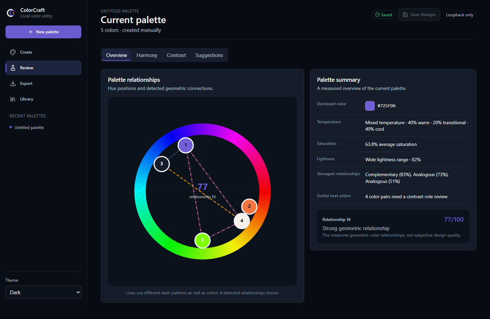
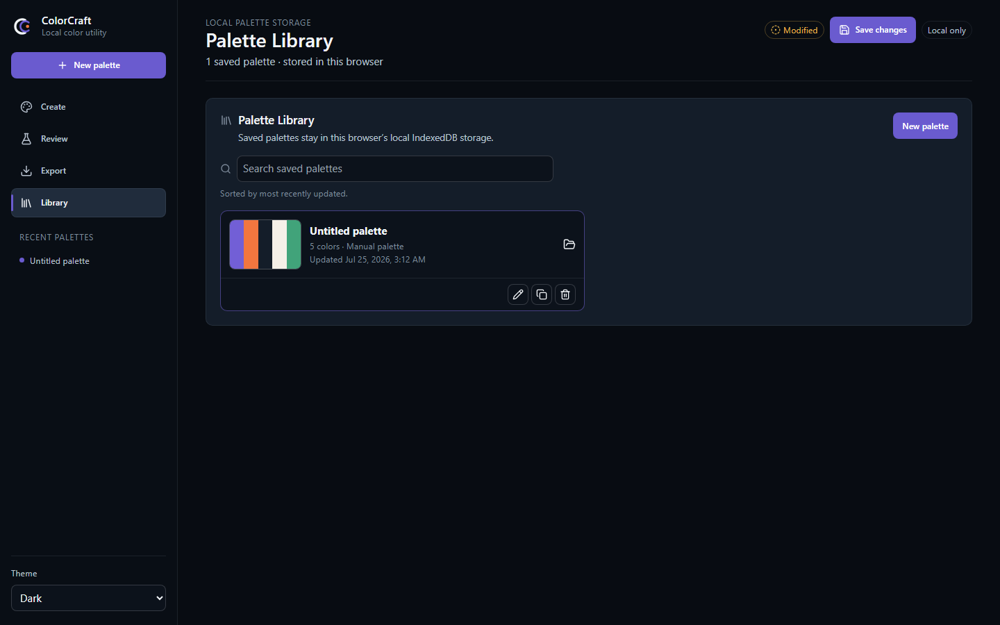

# ColorCraft

<p align="center">
  
</p>

<p align="center"><strong>A local workspace for extracting, editing, reviewing, saving, and exporting color palettes.</strong></p>

<p align="center">
  <a href="https://github.com/Artsen/ColorCraft/actions/workflows/ci.yml"></a>
  <a href="./LICENSE"></a>
  
</p>

ColorCraft creates a palette from a source image or from colors that you enter
manually. It detects geometric hue relationships, evaluates contrast, proposes
optional colors, and generates browser-side exports.



## Current workflow

1. Create a palette from a JPG, PNG, or WebP source image, or select **Start manually**.
2. Edit, add, duplicate, remove, or sample palette colors.
3. Select **Analyze palette**.
4. Use **Overview**, **Harmony**, **Contrast**, and **Suggestions** in Review.
5. Assign color roles and evaluate the applicable contrast pairs.
6. Use Export to generate **CSS custom properties**, **JSON**, **Tailwind theme colors**, or an **SVG swatch sheet**.
7. Select **Copy** or **Download**.

Relationship fit measures geometric agreement with documented hue structures, not aesthetic quality. Contrast checks measure one accessibility requirement; they do not prove complete WCAG conformance.

The API accepts a source image up to 10 MB and 40 million decoded pixels. Extraction returns 3–10 requested colors, or fewer for a limited processing sample. **Save palette** stores a versioned record in IndexedDB. The Library can open, search, rename, duplicate, and delete saved palettes.

ColorCraft has no accounts or cloud synchronization. Source-image bytes and unsaved changes remain session-only. Browser history stores the active view and Review tab, not palette data. Export generation runs in the browser.



## Quick start

Use Python 3.11 and Node.js 20 or newer:

```powershell
py -3.11 -m venv backend\.venv311
.\backend\.venv311\Scripts\python.exe -m pip install -r backend\requirements-dev.txt
cd frontend
corepack pnpm@9.15.9 install
cd ..
.\backend\.venv311\Scripts\python.exe dev.py
```

The web application starts at `http://127.0.0.1:5174`; the API starts at `http://127.0.0.1:4100`. The default configuration accepts loopback traffic only. Trusted LAN access expands the security boundary and requires opt-in.

Read [Getting started](./docs/getting-started.md) for Windows, macOS, Linux, manual startup, configuration, shutdown, and recovery procedures.

## Documentation

Use the [documentation index](./docs/README.md) for user, technical, operations, and contribution guides. All documentation follows [ColorCraft Technical English](./docs/writing-style.md).

## Validation

Run the complete local and CI gate:

```powershell
.\backend\.venv311\Scripts\python.exe check.py
```

The gate checks formatting, linting, types, tests, coverage, the production
build, browser workflows, and representative accessibility states.

## License

[MIT](./LICENSE)
