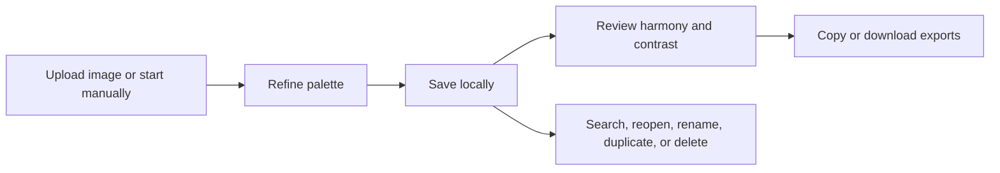

# ColorCraft

<p align="center">
  
</p>

<p align="center"><strong>A local-first workspace for extracting, refining, reviewing, saving, and exporting color palettes.</strong></p>

<p align="center">
  <a href="https://github.com/Artsen/ColorCraft/actions/workflows/ci.yml"></a>
  <a href="./LICENSE"></a>
  
</p>


ColorCraft turns an image or a hand-built set of colors into practical design evidence. It extracts representative colors, detects geometric harmony relationships, checks WCAG contrast, suggests additions, and exports reusable values. Saved palettes stay in the current browser. Uploaded source images are processed for the active session and are not placed in persistent browser storage.

## Quick start

Use Python 3.11 and Node.js 20 or newer. From the repository root:

```powershell
py -3.11 -m venv backend\.venv311
.\backend\.venv311\Scripts\python.exe -m pip install -r backend\requirements-dev.txt
cd frontend
corepack pnpm@9.15.9 install
cd ..
.\backend\.venv311\Scripts\python.exe dev.py
```

On macOS or Linux, create `backend/.venv`, install the same requirements, then run `backend/.venv/bin/python dev.py`. One launcher starts both services and opens the app:

- Web: `http://127.0.0.1:5174`
- API: `http://127.0.0.1:4100`
- Runtime metadata: `http://127.0.0.1:4100/metadata`

See [Getting started](./docs/getting-started.md) for setup and recovery details.

## Product workflow


```mermaid
flowchart LR
    Start[Upload image or start manually] --> Edit[Refine palette]
    Edit --> Save[Save locally]
    Save --> Review[Review harmony and contrast]
    Review --> Export[Copy or download exports]
    Save --> Library[Search, reopen, rename, duplicate, or delete]
```

The application makes state explicit: **Unsaved** means no local record exists, **Saved** means the open palette matches its record, and **Modified** means local edits need **Save changes**. Starting another palette or opening a saved palette prompts before meaningful unsaved work is discarded.

## Capabilities

- Deterministic LAB-space image color extraction
- Manual palette creation and direct HEX editing
- Harmony visualization and explainable relationship fit
- WCAG contrast-role review and color suggestions
- CSS, JSON, Tailwind, and token export
- IndexedDB palette library with search and recent items
- Light, dark, and system themes with responsive navigation
- Dashboard discovery through a static manifest and runtime metadata endpoint

## Validation

After installing the development dependencies and Playwright Chromium:

```powershell
cd frontend
corepack pnpm@9.15.9 exec playwright install chromium
cd ..
.\backend\.venv311\Scripts\python.exe check.py
```

`check.py` runs formatting, linting, frontend and backend typing, unit and integration coverage, production build, Playwright workflow coverage, and automated accessibility checks. CI runs the same command. See [Testing](./docs/testing.md).

## Documentation

The [documentation index](./docs/README.md) links setup, workflow, runtime configuration, architecture, API, persistence and privacy, dashboard manifest, brand, testing, screenshot review, and troubleshooting guides.

## Privacy and security

ColorCraft binds to loopback addresses by default. Palette records are stored in the browser's IndexedDB database; theme preference is the only application preference stored in LocalStorage. Source images are sent to the local API for extraction but are not retained by ColorCraft after processing. Clearing site data removes saved palettes. Read [Persistence and privacy](./docs/persistence-and-privacy.md) before enabling LAN access.

## License

[MIT](./LICENSE)
