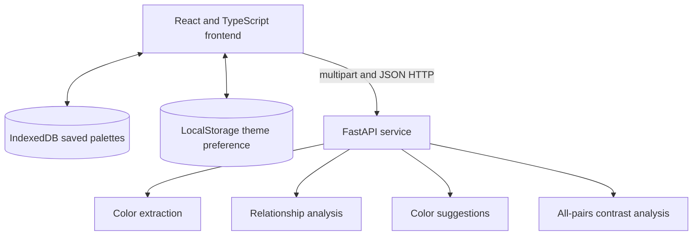

# Architecture

## System boundary

The frontend and API are separate local processes. `dev.py` resolves one runtime
configuration, starts both processes, waits for `/ready`, and stops both
processes on shutdown.

## Frontend

The React frontend owns:

- Create, Review, Export, and Library navigation
- Source-image preview state
- Palette editing and HEX validation
- Color-role assignments
- Stale-analysis invalidation
- Suggestion invalidation
- Browser-side export generation
- Saved palette persistence
- Theme preference

Pydantic models define API responses. Matching Zod schemas validate API
responses in the frontend. Public JSON fields use camelCase.

## API

The FastAPI service is stateless. It validates request data, performs extraction
and analysis, and returns explicit response models. It does not store palette
records or source images.

The API runs CPU-intensive color extraction in a worker thread. The async
request loop remains available while scikit-learn performs clustering.

See [API contracts](./api-contracts.md) for the canonical route and field
reference.

## Extraction flow

See [Color analysis](./color-analysis.md) for exact limits, formulas, and
interpretation constraints.

## Analysis flow

The frontend sends 2–10 normalized palette colors to
`POST /api/analyze-colors`. The API:

1. Verifies that HEX, RGB, and HSL describe the same color.
2. De-duplicates meaningful hue evidence.
3. Detects harmony relationships with circular hue calculations.
4. Calculates relationship confidence and relationship fit.
5. Calculates all-pairs contrast data.
6. Returns a camelCase `analysis` contract.

The frontend combines the API analysis with current role assignments. Contrast
shows role-specific checks and an advanced all-pairs contrast matrix.

## Suggestions flow

The frontend sends 1–10 colors to `POST /api/suggest-colors`. The API generates
suggestion approaches for each base color. Suggestions do not change the
palette automatically. The user must select **Add**.

The frontend fingerprints the current palette. A palette color change
invalidates the displayed suggestion results.

## Export flow

The frontend generates every export without an API request:

- CSS custom properties
- Schema-versioned JSON
- Tailwind theme colors
- SVG swatch sheet

CSS and Tailwind comments replace line breaks and the `*/` sequence in the
palette name. SVG output escapes `&`, `<`, `>`, `"`, and `'`. Download uses an
object URL and revokes the URL after the browser starts the download.

Export does not create or update a saved palette record.

## Session and persistence

The current source-image preview, analysis, suggestions, and unsaved changes
remain in memory. The URL records the active application view and Review tab.

Saved palette records use schema version 1 in the browser's `colorcraft`
IndexedDB database. The frontend validates each record before use. It migrates
unversioned and version-0 records. It ignores malformed records and unknown
future schema versions.

Source-image bytes are not part of a saved palette record. See
[Persistence and privacy](./persistence-and-privacy.md).

## Runtime and security boundaries

The default services bind to `127.0.0.1`. CORS accepts the resolved web origin.
Wildcard origins are rejected. Non-loopback hosts and origins require
`COLORCRAFT_ALLOW_LAN_ACCESS=true`.

ColorCraft does not provide authentication. Trusted LAN access expands the
network boundary. Do not expose the development API directly to an untrusted
network.

See [Runtime configuration](./runtime-configuration.md) for exact settings.
