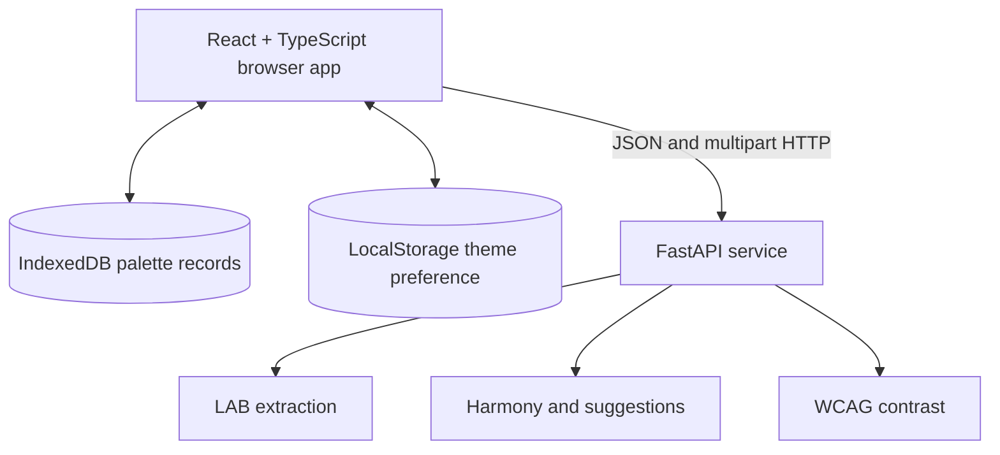

# Architecture

The frontend owns navigation, transient image preview state, explicit save state, role assignments, exports, and the local palette repository. `persistence.ts` validates every stored record with Zod, migrates legacy version-0 records to schema version 1, and ignores malformed or unknown future records without crashing the Library.

The backend is stateless. It validates contract models with Pydantic and delegates CPU-heavy extraction to a thread pool. Color extraction uses deterministic sampling, LAB conversion, KMeans clustering, and representative processed pixels. Theory, suggestions, and contrast operate on normalized color contracts.

`dev.py` is a process supervisor rather than an application server. It resolves configuration once, starts the API and Vite with consistent values, checks `/ready`, optionally opens the browser, and forwards shutdown to both processes.

Dashboard integration has two layers: the checked-in static manifest advertises stable defaults, while `/metadata` reports the runtime-resolved addresses. See [API](./api.md) and [Persistence and privacy](./persistence-and-privacy.md).
